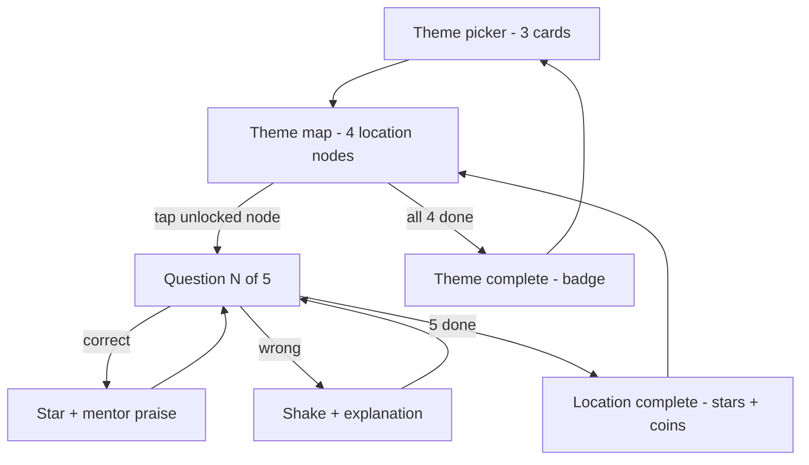

<!-- 211bbb58-f876-43a9-9981-39b2f1da6851 -->
---
todos:
- id: "add-card-menu"
  content: "Add Adventure Academy card to root index.html"
  status: pending
- id: "create-html"
  content: "Create games/adventure-academy/index.html with screens, state machine, audio synth, mentor, animations, localStorage progress"
  status: pending
- id: "seed-themes-json"
  content: "Author data/themes.json catalog of the 3 themes"
  status: pending
- id: "seed-space"
  content: "Author 20 Ukrainian questions for data/space.json (Космос, 4 locations)"
  status: pending
- id: "seed-body"
  content: "Author 20 questions for data/human-body.json (Тіло людини, 4 locations)"
  status: pending
- id: "seed-egypt"
  content: "Author 20 questions for data/ancient-egypt.json (Давній Єгипет, 4 locations)"
  status: pending
- id: "sw-precache"
  content: "Add new assets to sw.js PRECACHE and bump CACHE_NAME to mini-games-v4; update the hardcoded cache name in tests/smoke.spec.js"
  status: pending
- id: "tests"
  content: "Update menu test to assert 3 cards; add 3 smoke tests for adventure-academy"
  status: pending
  isProject: false
---
# Adventure Academy

A quiz-quest for ages 9-11 driven by [games/adventure-academy/idea.md](games/adventure-academy/idea.md): pick a theme, travel a small map of 4 locations, answer 5 questions per location, collect stars/coins/badges, with a mentor owl giving praise or gentle correction.

## Architecture



Follows the [.cursor/skills/simple-games/SKILL.md](.cursor/skills/simple-games/SKILL.md) rules: one self-contained HTML file with inline CSS/JS, JSON content under `data/`, plus a link card on the root menu. Mirrors the structural conventions already used in [games/first-million/index.html](games/first-million/index.html) (top bar with back link, screen-swap views, Web Audio synth, modal overlays, localStorage for state).

## New files

- `games/adventure-academy/index.html` — all game logic (screens, state machine, audio, mentor, animations)
- `games/adventure-academy/data/themes.json` — catalog of 3 themes (id, title, emoji, color, file)
- `games/adventure-academy/data/space.json` — Космос: 4 locations x 5 questions
- `games/adventure-academy/data/human-body.json` — Тіло людини: same shape
- `games/adventure-academy/data/ancient-egypt.json` — Давній Єгипет: same shape

### Per-theme JSON schema

```json
{
  "id": "space",
  "title": "Космос",
  "emoji": "🚀",
  "color": "#5b21b6",
  "intro": "Подорож зорями",
  "locations": [
    {
      "id": "moon",
      "title": "Місяць",
      "emoji": "🌙",
      "questions": [
        { "text": "...", "answers": ["A","B","C","D"], "correct": 1, "explanation": "...", "boss": false }
      ]
    }
  ]
}
```

Last question of every location is `"boss": true` for an extra coin and a stronger celebration.

### State (localStorage key `adventureAcademy:v1`)

```json
{
  "stars": 23, "coins": 4, "badges": ["space"],
  "themes": { "space": { "unlocked": ["moon","mars"], "completed": ["moon"] } },
  "voiceOn": false, "soundOn": true
}
```

Locations unlock sequentially inside a theme; all 3 themes are available from start.

## Screens in `games/adventure-academy/index.html`

- Top bar: back link `../../index.html`, stars + coins counters, voice toggle, sound toggle
- Theme picker (3 cards with completion %)
- Theme map: SVG/CSS path with 4 nodes, locked nodes greyed, current node pulses
- Question view: large text, optional `media` HTML, 4 big answer buttons, 5 progress dots, mentor bubble 🦉
- Correct overlay: star burst + confetti + mentor praise, auto-advance
- Wrong overlay: shake + ✗ + explanation card + "Продовжити" (no penalty — supports the "помилився → зрозумів → спробував" loop from the idea)
- Location-complete overlay: earned stars/coins, streak bonus, "Далі"
- Theme-complete overlay: badge animation, return to picker

Mentor (Сова 🦉): bucket of praise phrases on correct, soft hint phrases + the data `explanation` on wrong.

Voice-over: `speechSynthesis.speak(question.text, { lang: 'uk-UA' })` behind toggle; silently skips when no Ukrainian voice is installed.

Audio: reuse Web Audio synth pattern from [games/first-million/index.html](games/first-million/index.html) for select / correct / wrong / star / badge tones.

## Edits to existing files

- [index.html](index.html) near line 400 in `<nav class="menu">` — add a third game card:

```html
<a class="game-card" href="games/adventure-academy/index.html">
    <div class="icon">🎒</div>
    <h2>Академія пригод</h2>
    <p>Подорожуй темами — Космос, Тіло, Єгипет. Збирай зірки й бейджі.</p>
</a>
```

- [sw.js](sw.js) — append to `PRECACHE` (lines 3-21):

```js
"./games/adventure-academy/",
"./games/adventure-academy/index.html",
"./games/adventure-academy/data/themes.json",
"./games/adventure-academy/data/space.json",
"./games/adventure-academy/data/human-body.json",
"./games/adventure-academy/data/ancient-egypt.json",
```

Bump `CACHE_NAME` from `"mini-games-v3"` to `"mini-games-v4"`.

- [tests/smoke.spec.js](tests/smoke.spec.js) line 69 — update the hardcoded cache name to `mini-games-v4`; extend `menu lists both games` to assert all three game links; add new tests:
    - adventure-academy theme picker renders 3 themes
    - opening a theme shows 4 location nodes with only the first unlocked
    - answering the first question advances the progress indicator

## Scope assumption — please flag if you want to narrow

The plan assumes I author all 60 Ukrainian questions (3 themes x 4 locations x 5 questions) inline when implementing, each with an `explanation` for the soft-correction loop. If that is too much for a single change, I can ship MVP with only 1 theme seeded (Космос) and stubs for the other two.