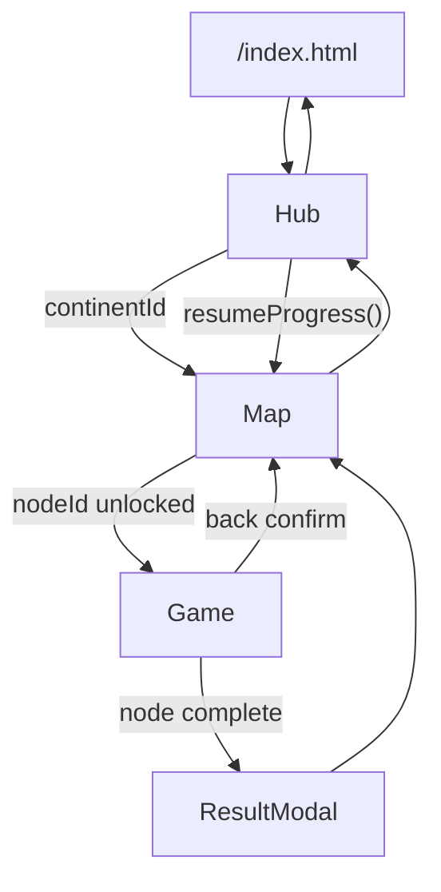

# Geo Quest — деталізований план розробки

> Версія документа: 1.0 · Оновлено: 2026-05-27  
> Статус: **MVP реалізовано** (v1). Далі — v1.1 (прапори, нові континенти).

---

## Зміст

1. [Мета та джерела](#1-мета-та-джерела)
2. [Відповідність макетам](#2-відповідність-макетам)
3. [Фази релізу](#3-фази-релізу)
4. [Архітектура](#4-архітектура)
5. [Екрани та UI-компоненти](#5-екрани-та-ui-компоненти)
6. [Механіка прогресу](#6-механіка-прогресу)
7. [Типи міні-ігор](#7-типи-міні-ігор)
8. [Схеми даних (JSON)](#8-схеми-даних-json)
9. [Контент-план MVP](#9-контент-план-mvp)
10. [Движок у index.html](#10-движок-у-indexhtml)
11. [Стилі та анімації](#11-стилі-та-анімації)
12. [Інтеграція в репозиторій](#12-інтеграція-в-репозиторій)
13. [Тестування](#13-тестування)
14. [Етапи робіт](#14-етапи-робіт)
15. [Ризики](#15-ризики)
16. [Критерії готовності MVP](#16-критерії-готовності-mvp)

---

## 1. Мета та джерела

### 1.1. Однореченнява мета

**Geo Quest** — навчальна веб-гра з географії для дітей: подорож світом через карту пригод, міні-ігри на кожній точці, поступове відкриття маршруту та нагороди за знання.

### 1.2. Джерела в репозиторії

| Файл | Призначення |
|------|-------------|
| `ідея гри.md` | Бізнес-логіка: глобус, континенти, залежності зірок, список типів завдань |
| `головна.png` | Референс хабу: глобус, HUD, 7 континентів, кнопки навігації, бічні панелі |
| `приклад карти континенту.png` | Референс карти регіону: стежка зірок, маркери, біоми (поверхня / під воду) |
| `план.md` | Цей документ — єдина специфікація для розробки |

### 1.3. Аудиторія та сесія

- **Вік:** 9–11 років (узгоджено з «Академією пригод»).
- **Тривалість сесії:** 5–10 хвилин (3 питання × 1 маркер ≈ 2–3 хв; 2–3 маркери за сесію).
- **Мова інтерфейсу та контенту:** українська (`lang="uk"`).
- **Принцип помилки:** без «game over»; помилка → пояснення → наступне питання без втрати прогресу маршруту.

### 1.4. Технічні обмеження репозиторію

Згідно з `.cursor/skills/simple-games/SKILL.md`:

- Один файл логіки: `games/geo-quest/index.html` (inline `<style>` + `<script>`).
- Дані: `games/geo-quest/data/**/*.json`.
- Без npm, bundler, фреймворків.
- Патерни з `adventure-academy` та `first-million`: екрани `.screen`, Web Audio, `localStorage`, `gameUrl()` для GitHub Pages.

---

## 2. Відповідність макетам

### 2.1. Макет «головна.png» — що беремо в MVP

| Елемент макету | MVP | Пізніше |
|----------------|-----|---------|
| Глобус з ландмарками, свайп | Так (спрощений CSS/SVG) | 3D-текстури |
| Профіль «Explorer», рівень 12, XP 820/1200 | Ні | v2 |
| Монети + кристали (gems) | Лише монети + зірки | gems у v2 |
| Кнопки: Продовжити / Вибір рівня / Міні-ігри | Перші дві; третя — v1.1 | — |
| 7 континентів + прогрес зірок | Так | — |
| Зібрано зірок / Досягнення (footer) | Так (спрощено) | повний список досягнень v1.1 |
| Бічні: Подорож, Турніри, Інвентар, Магазин | Ні (приховано) | v2–v3 |
| Щоденні завдання, Рейтинг, Друзі | Ні | v3+ |
| Налаштування (шестерня) | Лише звук + озвучка в top bar | повні settings v2 |

### 2.2. Макет «приклад карти континенту.png»

| Елемент | Реалізація |
|---------|------------|
| Вертикальна карта, два біоми | `map.biomes[]`: `surface` (верх), `underwater` (низ) |
| Стежка з жовтих зірок | SVG `<polyline>` + декоративні зірки між вузлами |
| Круглі маркери з персонажами | `node.emoji` + опційно `node.icon` (URL) |
| Заповнені / порожні зірки на шляху | CSS-клас `trail-star--done` / `trail-star--pending` |
| Кнопка «назад» (рука) | `.back-link` зліва зверху |

### 2.3. Зв’язок з `ідея гри.md`

| Вимога з ідеї | Розділ плану |
|---------------|--------------|
| Глобус, свайп, міні-ігри на точках | §5.1 Hub |
| Окрема локація океану | §9.2 `ocean.json` |
| Карта континенту, маркери | §5.2 Map |
| 2 з 3 зірок для наступного маркера | §6.3 |
| Вікторина, так/ні, пазли | §7 |
| Монети, стікери, бейджі, комбо | §6.4–6.6 |

---

## 3. Фази релізу

### 3.1. MVP (v1) — ціль першого публічного релізу

- Екрани: Hub, Map, Game, 3 модалки (locked, result, error load).
- Регіони з повним контентом: **Європа** (6 маркерів), **Світовий океан** (4 маркери).
- Регіони-заглушки: Африка, Азія, Північна Америка, Південна Америка, Австралія/Океанія, Антарктида (`comingSoon: true`).
- Типи міні-ігор: `quiz`, `yesno`, `capital`, `mapTap`.
- Прогрес: `localStorage` ключ `geoQuest:v1`, офлайн через `sw.js`.

### 3.2. v1.1

- Типи: `flag`, `silhouette`, `coast`, `river`, `audioLang`.
- Бейдж за 100% зірок на континенті.
- Кнопка «Міні-ігри» (випадковий раунд).
- Другий повний континент (рекомендація: **Африка**).
- Послідовне відкриття континентів на глобусі.

### 3.3. v2

- `mapPuzzle`, стікери в інвентарі, XP/рівень гравця, щоденне завдання (1 на день, localStorage).

### 3.4. v3+

- Турніри, рейтинг, друзі, магазин — **лише** за наявності бекенду; у v1 не показувати disabled-кнопки, що обіцяють онлайн.

---

## 4. Архітектура

### 4.1. Потік навігації



### 4.2. Стан застосунку (runtime, не localStorage)

```javascript
const app = {
  screen: "hub",           // hub | map | game
  continentId: null,       // "europe" | "ocean" | ...
  continentData: null,     // parsed JSON continent file
  nodeId: null,
  roundIndex: 0,           // 0 .. rounds.length-1
  session: {
    correct: 0,
    wrong: 0,
    combo: 0,
    comboMax: 0,
    coinsEarned: 0
  }
};
```

### 4.3. Структура каталогу (цільова)

```
games/geo-quest/
  index.html
  план.md
  ідея гри.md
  головна.png                 # референс, не в precache
  приклад карти континенту.png
  data/
    world.json
    continents/
      europe.json
      ocean.json
      africa.json             # v1.1+, MVP: лише id у world з comingSoon
    maps/
      europe-simple.json
  assets/                       # опційно v1.1
    flags/                      # SVG або emoji fallback
    audio/                      # mp3 для audioLang
```

### 4.4. Залежності між модулями (всередині одного script)

```
gameUrl → fetchJSON → world / continent / map
       ↓
state (load/save geoQuest:v1)
       ↓
progress (canUnlock, starsForSession, resume)
       ↓
router (showScreen)
       ↓
renderHub | renderMap | renderGame
       ↓
renderers[type] → checkAnswer → feedback
       ↓
audio, voice, confetti
```

---

## 5. Екрани та UI-компоненти

### 5.1. Екран Hub (`#screen-hub`)

**HTML-скелет (орієнтир для Етапу 0):**

```html
<div id="screen-hub" class="screen active">
  <header class="top-bar">...</header>
  <div class="hud">...</div>
  <div class="globe-stage" id="globe-stage">...</div>
  <div class="hub-actions">
    <button id="btn-resume" class="btn btn-primary">Продовжити подорож</button>
    <button id="btn-levels" class="btn btn-secondary">Вибір рівня</button>
  </div>
  <div class="continent-strip" id="continent-strip">...</div>
  <footer class="hub-footer">
    <span id="stars-total">0 / 0</span>
    <span id="badges-total">0 / 0</span>
  </footer>
</div>
```

**Поведінка:**

| ID / клас | Подія | Дія |
|-----------|-------|-----|
| `#btn-resume` | click | `resumeProgress()` → `openContinent` + `openMap` + scroll до поточного маркера |
| `#btn-levels` | click | `continent-strip.scrollIntoView()` |
| `.continent-chip` | click | якщо не `comingSoon` → завантажити континент, `showScreen("map")` |
| `.continent-chip--locked` | click | toast «Скоро відкриється!» |
| `#globe-stage` | pointermove / touch | оновити `rotateY` (макс ±40°) |
| `.globe-hotspot` | click | те саме, що continent-chip за `data-continent-id` |

**Глобус (MVP):**

- Контейнер `.globe` (коло  min(90vw, 320px) ).
- Внутрішній шар `.globe-sphere` з `background: radial-gradient(...)` + `transform: rotateY(var(--globe-y))`.
- 7 `.globe-hotspot` + 1 для океану — позиції у % від центру (таблиця нижче).
- Emoji-ландмарки (статичні, не клікабельні): 🗽 🗼 🏛️ 🗿 тощо — декор.

**Позиції hotspots на глобусі (нормалізовані, центр 50%,50%):**

| id | emoji | left% | top% |
|----|-------|-------|------|
| europe | 🏰 | 52 | 38 |
| asia | 🏯 | 68 | 42 |
| africa | 🦁 | 54 | 55 |
| north-america | 🗽 | 28 | 40 |
| south-america | 🌴 | 34 | 68 |
| oceania | 🦘 | 78 | 72 |
| antarctica | 🐧 | 50 | 88 |
| ocean | 🌊 | 62 | 58 |

**Смуга континентів (fallback + «Вибір рівня»):**

- Горизонтальний scroll, `.continent-chip` з emoji, назвою, `3/18` зірок.
- `comingSoon`: opacity 0.45, іконка 🔒.

### 5.2. Екран Map (`#screen-map`)

```html
<div id="screen-map" class="screen">
  <header class="top-bar">
    <button id="map-back" class="back-link">← До глобуса</button>
    <h2 id="map-title">Європа</h2>
  </header>
  <div class="map-scroll" id="map-scroll">
    <svg id="map-svg" viewBox="0 0 800 1200">...</svg>
  </div>
</div>
```

**Шари SVG (знизу вгору):**

1. `<rect>` фон біому `surface`
2. `<rect>` фон біому `underwater` (y > 600)
3. `<polyline class="trail">` — стежка через усі `node.x*800`, `node.y*1200`
4. `<g class="trail-stars">` — декоративні зірки між вузлами
5. `<g class="nodes">` — `<g class="node" data-id>` з колом + emoji + 3 маленькі зірки

**Стани маркера (CSS-класи):**

| Клас | Умова |
|------|--------|
| `node--locked` | `!canUnlock(node)` |
| `node--available` | розблоковано, зірок 0 |
| `node--current` | перший available без зірок або `resume` вказує сюди |
| `node--stars-1` … `node--stars-3` | збережено 1–3 зірки |

**Клік по маркеру:**

- `locked` → модалка `#modal-locked` з текстом: «Потрібно щонайменше 2 ⭐ на «{prevTitle}»».
- інакше → `startNode(nodeId)`.

### 5.3. Екран Game (`#screen-game`)

```html
<div id="screen-game" class="screen">
  <header class="game-header">
    <span id="game-location">Україна · 1/3</span>
    <div class="dots" id="round-dots"></div>
  </header>
  <div id="mentor-bubble" class="mentor" hidden></div>
  <div id="game-prompt" class="prompt"></div>
  <div id="game-media" class="media"></div>
  <div id="game-answers" class="answers"></div>
  <div id="combo-banner" class="combo-banner" hidden></div>
</div>
```

**Після відповіді:**

- Правильно: зелений flash, `audio.correct()`, +монета, combo++.
- Неправильно: shake, `audio.wrong()`, показ `#modal-feedback` з `explanation`, кнопка «Далі» (не зменшує combo до 0 — лише скидає combo streak; **уточнення для MVP:** помилка скидає combo на 0, правильна серія з нуля — простіше для дітей).

### 5.4. Модалки

| id | Коли | Кнопки |
|----|------|--------|
| `#modal-locked` | маркер заблоковано | OK |
| `#modal-result` | завершено всі rounds маркера | «На карту» |
| `#modal-feedback` | невірна відповідь | «Далі» |
| `#modal-badge` | v1.1, континент 100% | «Чудово!» |

### 5.5. Top bar (усі екрани)

- `← Меню` → `../../index.html`
- `#hud-stars`, `#hud-coins`
- `#sound-toggle`, `#voice-toggle` (як у AA/FM)

---

## 6. Механіка прогресу

### 6.1. localStorage — ключ `geoQuest:v1`

**Повна схема:**

```typescript
interface GeoQuestSave {
  version: 1;
  coins: number;
  totalStars: number;        // кешована сума; перераховувати при save
  comboBest: number;         // рекорд комбо за всі сесії
  soundOn: boolean;
  voiceOn: boolean;
  lastPlayed?: {
    continentId: string;
    nodeId: string;
  };
  continents: Record<string, {
    nodes: Record<string, {
      stars: 0 | 1 | 2 | 3;
      bestCombo?: number;
      completedAt?: string;  // ISO date, опційно
    }>;
  }>;
  badges: string[];          // напр. "europe-complete"
}
```

**Правила збереження:**

- Писати в `localStorage` після: завершення маркера, зміни налаштувань звуку.
- `totalStars` = сума `node.stars` по всіх континентах (перерахунок, не інкремент вручну).
- Зірки на маркері **не знижуються** при повторному проходженні; лише якщо новий результат вищий.

### 6.2. Розрахунок зірок за маркер

Після `rounds.length` питань, змінні сесії: `correct`, `wrong`, `comboMax`.

```javascript
const THRESHOLD = {
  STAR1_RATIO: 0.5,   // ≥50% правильних
  STAR2_RATIO: 0.8,   // ≥80%
  STAR3_RATIO: 1.0,   // 100%
  STAR3_COMBO: 3      // або comboMax >= 3 при ≥1 помилці
};

function starsForSession(correct, total, comboMax, wrong) {
  const ratio = correct / total;
  if (ratio < THRESHOLD.STAR1_RATIO) return 0;
  if (ratio >= THRESHOLD.STAR3_RATIO) return 3;
  if (ratio >= THRESHOLD.STAR2_RATIO && wrong <= 1) return 2;
  if (comboMax >= THRESHOLD.STAR3_COMBO && ratio >= THRESHOLD.STAR2_RATIO) return 3;
  if (ratio >= THRESHOLD.STAR2_RATIO) return 2;
  return 1;
}
```

| Зірки | Умова (MVP) |
|-------|-------------|
| 0 | < 50% правильних |
| 1 | ≥ 50% |
| 2 | ≥ 80% або ≤1 помилка при ≥50% |
| 3 | 100% **або** (≥80% і comboMax ≥ 3) |

### 6.3. Відкриття маркера на карті

```javascript
function canUnlock(node, continentData, save) {
  const u = node.unlock;
  if (!u || u.type === "free") return true;
  const prev = continentData.nodes.find(n => n.id === u.requires);
  if (!prev) return true;
  const prevStars = save.continents[continentData.id]?.nodes[prev.id]?.stars || 0;
  return prevStars >= (u.minStars ?? 2);
}
```

- Перший вузол у `nodes[]` завжди `"unlock": { "type": "free" }`.
- Ланцюжок лінійний: node[i] вимагає node[i-1] (рекомендований порядок у JSON).

### 6.4. Відкриття континенту на глобусі

| Фаза | Правило |
|------|---------|
| MVP | Усі континенти в `world.json` без `comingSoon` доступні; `comingSoon` — замок |
| v1.1 | `unlock: { "type": "continent", "requires": "europe", "minTotalStars": 12 }` |

### 6.5. Монети

| Подія | Монети |
|-------|--------|
| Правильна відповідь | +1 |
| Combo ≥ 3 (наступна правильна) | +2 замість +1 (банер «Комбо x2!») |
| Завершення маркера з 3 зірками | +3 бонус |
| Boss-round (`boss: true`) | ×2 за це питання |

### 6.6. Комбо

- Лічильник `session.combo` скидається в 0 при невірній відповіді.
- `session.comboMax` = max за сесію маркера.
- Візуал: `#combo-banner` при combo ≥ 2.

### 6.7. Бейджі (v1.1)

- `europe-complete`: сума зірок на всіх node Європи === `3 * nodes.length`.
- Аналогічно `ocean-complete`.
- Показ модалки один раз; id бейджа в `save.badges`.

### 6.8. resumeProgress()

```javascript
function resumeProgress(save, world) {
  // 1. Якщо save.lastPlayed — відкрити цей континент і node
  // 2. Інакше перший континент не comingSoon без 100% — перший node не max stars
  // 3. Інакше перший available node на Європі
}
```

### 6.9. Наставник (Mentor)

- Персонаж: **Компас Капітан 🧭** (або 🦜 — узгодити при верстці).
- Масиви `PRAISE[]`, `ENCOURAGE[]` — 8–12 фраз кожен.
- При правильній: випадкова похвала.
- При невірній: `ENCOURAGE` + `explanation` з JSON.

---

## 7. Типи міні-ігор

### 7.1. Загальні поля (всі типи)

| Поле | Тип | Обов’язкове | Опис |
|------|-----|-------------|------|
| `type` | string | так | Ідентифікатор рендерера |
| `text` | string | так* | Текст питання (*для mapTap — prompt) |
| `explanation` | string | так | Пояснення після помилки |
| `difficulty` | 1\|2\|3 | ні | Для майбутньої фільтрації |
| `media` | string (HTML) | ні | Безпечний підмножина: img, svg, .info-card |
| `boss` | boolean | ні | Подвійні монети, сильніша анімація |

### 7.2. `quiz`

```json
{
  "type": "quiz",
  "text": "Яка країна найбільша за площею в Європі?",
  "answers": ["Україна", "Франція", "Іспанія", "Норвегія"],
  "correct": 0,
  "explanation": "Україна — найбільша країна повністю в Європі за площею."
}
```

- UI: 4 кнопки `.answer-btn`, сітка 2×2 на широкому екрані.
- Перевірка: `selectedIndex === correct`.

### 7.3. `yesno`

```json
{
  "type": "yesno",
  "text": "Чорне море омиває береги України.",
  "correct": true,
  "explanation": "Так. Південне узбережжя України — на Чорному морі."
}
```

- UI: дві великі кнопки «Так» / «Ні».
- `correct`: boolean.

### 7.4. `capital`

```json
{
  "type": "capital",
  "text": "Столиця Італії:",
  "country": "Італія",
  "answers": ["Рим", "Мілан", "Венеція", "Неаполь"],
  "correct": 0,
  "explanation": "Рим — столиця Італії."
}
```

- Варіант «столиця → країна»: `"promptMode": "countryFromCapital"`, поле `capital`: «Париж».
- UI як `quiz`.

### 7.5. `mapTap` (MVP)

```json
{
  "type": "mapTap",
  "text": "Знайди на карті: Франція",
  "targetCountryId": "france",
  "mapId": "europe-simple",
  "explanation": "Франція — на заході Європи."
}
```

- Завантажити `data/maps/{mapId}.json`.
- Підсвітити всі країни з `highlight: true` або лише сусіди — **MVP:** показати всі країни з каталогу, клік по одній.
- При помилці: pulse на `targetCountryId` після закриття feedback.

### 7.6. Типи v1.1 (коротка специфікація)

| type | Поля | UI |
|------|------|-----|
| `flag` | `flagCode` або emoji, `answers[]`, `correct` | зображення прапора + 4 країни |
| `silhouette` | `countryId`, svg path | 4 назви країн |
| `coast` | `country`, `answers` (моря) | як quiz |
| `river` | `river`, `answers` (країни) | як quiz |
| `audioLang` | `audioUrl` або `speechText`, `answers` | кнопка ▶ + 4 мови |
| `mapPuzzle` | v2 | drag grid 3×3 |

---

## 8. Схеми даних (JSON)

### 8.1. `data/world.json`

```json
{
  "title": "Geo Quest",
  "tagline": "Досліджуй • Вивчай • Перемагай",
  "maxStarsPerContinent": {
    "europe": 18,
    "ocean": 12
  },
  "continents": [
    {
      "id": "europe",
      "title": "Європа",
      "emoji": "🏰",
      "color": "#3b82f6",
      "file": "data/continents/europe.json",
      "unlock": { "type": "free" }
    },
    {
      "id": "africa",
      "title": "Африка",
      "emoji": "🦁",
      "color": "#ca8a04",
      "file": "data/continents/africa.json",
      "comingSoon": true
    }
  ],
  "ocean": {
    "id": "ocean",
    "title": "Світовий океан",
    "emoji": "🌊",
    "color": "#0891b2",
    "file": "data/continents/ocean.json",
    "unlock": { "type": "free" }
  }
}
```

**Список континентів для world (повний каталог):**

| id | title | MVP |
|----|-------|-----|
| europe | Європа | контент |
| ocean | Світовий океан | окремий ключ `ocean` |
| asia | Азія | comingSoon |
| africa | Африка | comingSoon |
| north-america | Північна Америка | comingSoon |
| south-america | Півдня Америка | comingSoon |
| oceania | Австралія й Океанія | comingSoon |
| antarctica | Антарктида | comingSoon |

### 8.2. `data/continents/europe.json` — структура

```json
{
  "id": "europe",
  "title": "Європа",
  "map": {
    "viewBox": "0 0 800 1200",
    "biomes": [
      { "id": "surface", "y0": 0, "y1": 600, "background": "linear-gradient(180deg,#38bdf8,#86efac)" },
      { "id": "underwater", "y0": 600, "y1": 1200, "background": "linear-gradient(180deg,#0369a1,#0c4a6e)" }
    ]
  },
  "nodes": []
}
```

### 8.3. `data/maps/europe-simple.json`

```json
{
  "id": "europe-simple",
  "viewBox": "0 0 400 360",
  "countries": [
    {
      "id": "ukraine",
      "title": "Україна",
      "path": "M ... Z",
      "label": { "x": 280, "y": 140 }
    }
  ]
}
```

**MVP-набір країн для mapTap (мінімум 8):** ukraine, poland, france, germany, italy, spain, norway, greece.

- Шляхи SVG — спрощені полігони (не географічно ідеальні, але розрізняються).
- `path` можна згенерувати вручну або спростити з open GeoJSON (лише для розробника, не комітити важкі GeoJSON у v1).

---

## 9. Контент-план MVP

### 9.1. Європа — 6 маркерів × 3 раунди = 18 питань

| # | node.id | title | emoji | x | y | biome | Раунди (типи) |
|---|---------|-------|-------|---|---|-------|----------------|
| 1 | ukraine | Україна | 🇺🇦 | 0.62 | 0.32 | surface | capital, quiz, yesno |
| 2 | poland | Польща | 🇵🇱 | 0.58 | 0.28 | surface | mapTap, capital, quiz |
| 3 | france | Франція | 🇫🇷 | 0.42 | 0.38 | surface | capital, quiz, mapTap |
| 4 | italy | Італія | 🇮🇹 | 0.52 | 0.48 | surface | quiz, capital, yesno |
| 5 | spain | Іспанія | 🇪🇸 | 0.35 | 0.45 | underwater* | yesno, capital, quiz |
| 6 | norway | Норвегія | 🇳🇴 | 0.48 | 0.18 | surface | quiz, mapTap, quiz (boss) |

\* Маркер 5 візуально в зоні «під водою» на карті (як на макеті) — `y > 0.5`.

**Приклади текстів (чернетка для автора контенту):**

**ukraine — round 1 (capital):**  
«Столиця України?» → Київ / Львів / Одеса / Харків.

**ukraine — round 2 (quiz):**  
«Яке море омиває південь України?» → Чорне / Балтійське / Середземне / Північне.

**poland — round 1 (mapTap):**  
«Знайди Польщу на карті» → `targetCountryId: "poland"`.

**norway — round 3 (boss):**  
«Яка країна називається «країною фіордів»?» → Норвегія / Швеція / Данія / Фінляндія.

### 9.2. Світовий океан — 4 маркери × 3 = 12 питань

| # | node.id | title | emoji | Тематика |
|---|---------|-------|-------|----------|
| 1 | atlantic | Атлантика | 🌊 | океан, материки |
| 2 | pacific | Тихий океан | 🐋 | найбільший океан |
| 3 | arctic | Північний Льодовитий | 🧊 | клімат, тварини |
| 4 | indian | Індійський | 🪸 | омыває які материки |

**Типи:** переважно `yesno` та `quiz`; без `mapTap` (немає політичної карти).

**Приклад (atlantic — yesno):**  
«Атлантичний океан відокремлює Європу від Північної Америки.» → true.

### 9.3. Вимоги до контенту

- Факти перевіряти за підручником / Вікіпедія UA.
- Уникати суперечливих формулювань («найбільша в Європі» — уточнювати «повністю в межах Європи»).
- `explanation` — 1–2 речення, простою мовою.
- Не використовувати політично чутливі формулювання поза програмою 4 класу.

### 9.4. Обсяг зірок (для HUD)

| Регіон | Маркерів | Макс. зірок |
|--------|----------|-------------|
| Європа | 6 | 18 |
| Океан | 4 | 12 |
| **Разом MVP** | 10 | **30** |

Footer hub: `зібрано зірок: {totalStars} / 30`.

---

## 10. Движок у index.html

### 10.1. Константи (на початку script)

```javascript
const STORAGE_KEY = "geoQuest:v1";
const UNLOCK_MIN_STARS = 2;
const ROUNDS_PER_NODE = 3; // очікувана кількість; фактична = node.rounds.length
```

### 10.2. Публічні функції (мінімальний API)

| Функція | Опис |
|---------|------|
| `gameUrl(path)` | базовий шлях для fetch на GitHub Pages |
| `loadSave()` / `saveSave(data)` | localStorage |
| `showScreen(name)` | hub \| map \| game |
| `loadWorld()` | fetch world.json |
| `loadContinent(id)` | fetch continent file |
| `renderHub()` | DOM hub |
| `renderMap()` | SVG + nodes |
| `startNode(nodeId)` | ініціалізація session, round 0 |
| `renderRound()` | виклик `renderers[type]` |
| `submitAnswer(payload)` | перевірка + feedback |
| `finishNode()` | зірки, монети, modal |
| `canUnlock(node)` | див. §6.3 |
| `resumeProgress()` | див. §6.8 |

### 10.3. Об’єкт renderers

```javascript
const renderers = {
  quiz(ctx, round) { /* ... */ },
  yesno(ctx, round) { /* ... */ },
  capital(ctx, round) { /* ... */ },
  mapTap(ctx, round) { /* async load map */ }
};
```

### 10.4. Цикл гри (псевдокод)

```
startNode(nodeId):
  app.session = { correct:0, wrong:0, combo:0, comboMax:0, coinsEarned:0 }
  app.roundIndex = 0
  showScreen("game")
  renderRound()

renderRound():
  round = node.rounds[app.roundIndex]
  renderers[round.type](app, round)
  оновити dots, mentor, voice.read(round.text)

submitAnswer(ok):
  if ok: correct++, combo++, coins++
  else: wrong++, combo=0, show modal feedback
  if last round: finishNode()
  else: roundIndex++, renderRound()

finishNode():
  stars = starsForSession(...)
  merge into save (max stars)
  save.lastPlayed = { continentId, nodeId: next unlocked }
  show modal-result
```

### 10.5. gameUrl (як у сусідніх іграх)

```javascript
function gameUrl(rel) {
  const base = document.querySelector("base")?.href
    || new URL(".", window.location.href).href;
  return new URL(rel, base).pathname;
}
```

### 10.6. Озвучка та звук

- Скопіювати synth `audio.tick/correct/wrong/win` з adventure-academy.
- `voice.speak(text)` якщо `save.voiceOn` — `uk-UA`.

### 10.7. Доступність

- `aria-label` на кнопках відповідей.
- Фокус на modal при відкритті.
- Контраст тексту ≥ 4.5:1 на кнопках.

---

## 11. Стилі та анімації

### 11.1. Дизайн-токени

```css
:root {
  --gq-bg: #0f172a;
  --gq-gold: #fbbf24;
  --gq-star: #fde047;
  --gq-coin: #f59e0b;
  --gq-primary: #22c55e;
  --gq-secondary: #3b82f6;
  --gq-danger: #ef4444;
  --gq-radius: 14px;
  --gq-font: -apple-system, BlinkMacSystemFont, "Segoe UI", Roboto, Arial, sans-serif;
}
```

### 11.2. Ключові анімації

| Клас | Тригер |
|------|--------|
| `@keyframes screen-in` | зміна `.screen.active` |
| `@keyframes node-pulse` | `node--current` |
| `@keyframes shake` | неправильна відповідь |
| `@keyframes star-pop` | отримання зірок у modal |
| `confetti()` | 3 зірки — функція з FM |

### 11.3. Адаптив

- Mobile-first; `max-width: 720px` контент.
- `safe-area-inset` для iPhone.
- `touch-action: manipulation` на кнопках.
- Карта: вертикальний scroll, min-height біому 50vh кожен.

---

## 12. Інтеграція в репозиторій

### 12.1. Кореневе меню `index.html`

Додати картку (після adventure-academy):

```html
<a class="game-card" href="games/geo-quest/index.html">
  <div class="icon">🌍</div>
  <h2>Geo Quest</h2>
  <p>Досліджуй світ на карті пригод</p>
</a>
```

### 12.2. Service Worker `sw.js`

Додати до `PRECACHE`:

```
./games/geo-quest/
./games/geo-quest/index.html
./games/geo-quest/data/world.json
./games/geo-quest/data/continents/europe.json
./games/geo-quest/data/continents/ocean.json
./games/geo-quest/data/maps/europe-simple.json
```

- Bump `CACHE_NAME` (наприклад `mini-games-v5`).
- Оновити очікування в `tests/smoke.spec.js` для `total` assets.

### 12.3. Не кешувати

- `головна.png`, `приклад карти континенту.png`, `план.md` — документація.

---

## 13. Тестування

### 13.1. Playwright `tests/smoke.spec.js`

**Тест: `geo-quest hub loads continents`**

1. `goto /games/geo-quest/index.html`
2. Очікувати `#screen-hub.active`
3. Перевірити наявність `.continent-chip` ≥ 2
4. Текст «Європа» видимий

**Тест: `geo-quest europe first node`**

1. Клік по Європі
2. `#screen-map.active`
3. Клік по першому `.node:not(.node--locked)`
4. `#screen-game` + `.answer-btn` або `.answer-btn-yes`
5. Програмно: завантажити `europe.json`, відповісти `correct` на всі 3 раунди (клік по кнопці з індексом `correct`)
6. Після modal — перевірити `localStorage geoQuest:v1` містить `stars >= 1`

### 13.2. Ручний чекліст

- [ ] Свайп глобуса на телефоні
- [ ] Офлайн після першого відкриття (режим літака)
- [ ] Заблокований маркер показує modal
- [ ] Звук вимикається
- [ ] Повернення «Меню» не губить прогрес
- [ ] Повторне проходження маркера не зменшує зірки

---

## 14. Етапи робіт

| Етап | Дні | Завдання | Результат |
|------|-----|----------|-----------|
| **0** | 0.5 | `план.md` (цей файл), скелет HTML | Документація + порожні екрани |
| **1** | 1 | JSON world/europe/ocean + progress | Дані + lock logic |
| **2** | 1.5 | renderers + finishNode | Можна пройти 1 маркер |
| **3** | 1 | Hub + globe + strip | Повна навігація |
| **4** | 1–2 | 30 питань контенту | Повний MVP контент |
| **5** | 0.5 | sw.js + тести | Реліз |
| **6** | — | v1.1 | Нові типи + Африка |

### 14.1. Етап 0 — виконано

- [x] `index.html`: DOCTYPE, meta viewport, title «Geo Quest»
- [x] CSS: body, `.screen`, `.top-bar`, `.btn`, `.modal-backdrop`
- [x] HTML: три екрани + modals
- [x] JS: повний движок (hub, map, game, progress, renderers)
- [x] JSON: world, europe, ocean, europe-simple map
- [x] Інтеграція: меню, sw.js v20, smoke-тести geo-quest

---

## 15. Ризики

| Ризик | Ймовірність | Вплив | Пом’якшення |
|-------|-------------|-------|-------------|
| mapTap занадто важкий для 9 років | середня | високий | великі зони кліку; підказка після 1 помилки |
| SVG карти некоректні | низька | середній | спрощені контури, не exam-grade |
| Роздування scope через макет | висока | високий | таблиця §2.1, фази |
| 30 питань — довго писати | середня | середній | чернетка в §9, потім вичитка |
| GitHub Pages шлях fetch | низька | високий | `gameUrl()` з першого дня |

---

## 16. Критерії готовності MVP

- [x] Картка в кореневому меню; гра відкривається офлайн після precache
- [x] Hub: глобус/смуга, Європа + Океан без замка; інші — `comingSoon`
- [x] Карта Європи: 6 маркерів, стежка, lock за 2 ⭐
- [x] Океан: 4 маркери
- [x] Працюють `quiz`, `yesno`, `capital`, `mapTap`
- [x] Зірки 0–3, монети, комбо, збереження після F5
- [x] `resumeProgress` веде до останньої точки
- [x] 2 автотести в smoke.spec.js зелені

---

## Додаток A. Порівняння з Adventure Academy

| Аспект | Adventure Academy | Geo Quest |
|--------|-------------------|-----------|
| Навігація | Тема → 4 локації | Глобус → континент → N маркерів |
| Питань за рівень | 5 | 3 (MVP) |
| Зірки | 1 за локацію (5 max) | 0–3 за маркер |
| Unlock | послідовні локації | 2⭐ на попередньому маркері |
| Типи завдань | лише quiz | quiz, yesno, capital, mapTap+ |
| Дані | themes.json + theme files | world.json + continent + maps |

---

## Додаток B. Посилання на файли репозиторію

- [games/adventure-academy/index.html](../adventure-academy/index.html) — зразок state machine
- [games/first-million/index.html](../first-million/index.html) — modals, confetti, cheat pattern (не потрібен для GQ)
- [sw.js](../../sw.js) — precache
- [tests/smoke.spec.js](../../tests/smoke.spec.js) — e2e

---

*Кінець документа. Наступний крок: **v1.1** — прапори, coast/river, бейджі, континент Африка.*
